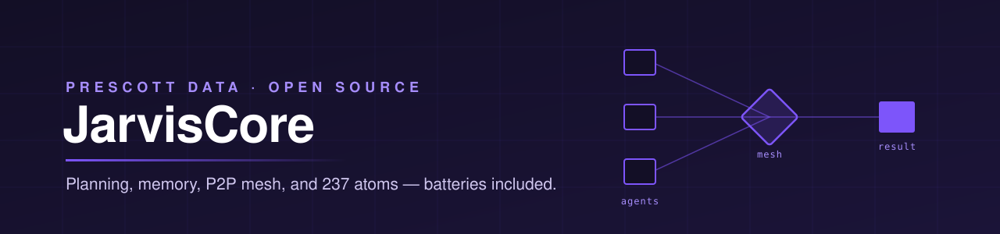
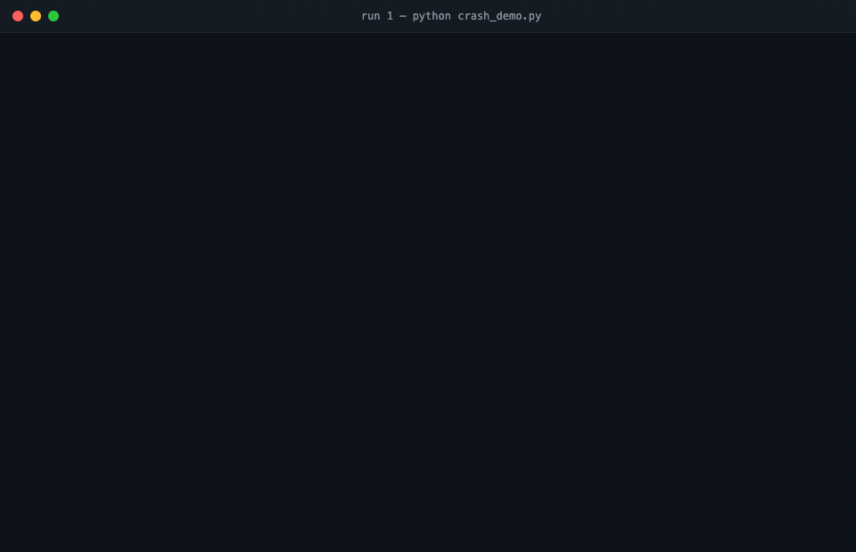

<p align="center">
  
</p>

<p align="center">
  <strong>The production runtime for multi-agent systems — a peer-to-peer mesh with no central orchestrator, zero-trust credentials, durable state that survives <code>kill -9</code>, and 237 typed atoms across 46 services. Observability included, not upsold.</strong>
</p>

<p align="center">
  <a href="https://pypi.org/project/jarviscore-framework/"></a>
  <a href="https://pypi.org/project/jarviscore-framework/"></a>
  <a href="https://pypi.org/project/jarviscore-framework/"></a>
  <a href="https://github.com/Prescott-Data/jarviscore-framework/blob/main/LICENSE"></a>
  <a href="https://jarviscore.developers.prescottdata.io/"></a>
</p>

```bash
pip install jarviscore-framework
```

<p align="center">
  
</p>
<p align="center">
  <sub>A 7-agent committee deliberates a $1.5M position on live market data. We <code>kill -9</code> it mid-deliberation.<br/>
  Rerun with the same workflow id: the four analyst results come back from Redis — not re-run, not re-billed — and the committee finishes the job.<br/>
  Real output, time compressed — reproduce it with <a href="examples/investment_committee"><code>examples/investment_committee</code></a> (<code>kill_watcher.py</code> stages the crash)</sub>
</p>

---

## Why developers switch

Six things you get here that you will not assemble from a typical agent framework:

**1. Agents never touch credentials.** Nexus, a zero-trust credential broker, ships inside the framework. Set `requires_auth = True` and the runtime injects scoped, encrypted credentials into atoms at call time — no raw keys in prompts, agent context, or `.env` sprawl. A leaked agent trace leaks no secrets.

**2. Tools without MCP plumbing.** 237 typed atoms across 46 services (`jarviscore atom list`), auth injected at runtime. Missing one? Write a Python function, validate it with `jarviscore atom test`, drop it in the registry — no server to stand up, no wiring. And when no atom exists, AutoAgents write their own sandboxed code with self-repair and keep what worked in a verified-work registry.

**3. No central orchestrator to babysit.** Agents form a SWIM gossip mesh over ZMQ, discover each other by capability, and claim workflow steps atomically from Redis. Any node can die — another claims its work. There is no coordinator process whose crash takes the fleet down.

**4. State outlives the process.** You just watched it: `kill -9` mid-deliberation, rerun the same workflow id, completed steps return `recovered` from Redis — not re-run, not re-billed.

**5. Observability is not an enterprise upsell.** Per-step traces (`jarviscore inspect <workflow>`), episodic ledgers, and Prometheus + Grafana in the bundled compose file — all in the Apache-2.0 package. No control-plane subscription to see what your agents did.

**6. Memory agents share, not just keep.** Athena is a structured knowledge graph with heat-based scoring — fleet memory that compounds across agents and sessions, not one agent's private diary.

---

## What is JarvisCore?

JarvisCore is a Python framework for building AI agent systems that can plan, reason, execute code, browse the web, search the internet, and connect to 46 external services out of the box. A single agent runs with three attributes. A fleet scales across machines with peer-to-peer discovery, shared memory, and crash recovery.

## Architecture

You write agents. JarvisCore owns the runtime underneath them: identity, memory, retrieval, routing, and recovery.

```text
                       your agents
            AutoAgent  ·  CustomAgent  ·  Workflows
                            │
  ┌─────────────────────────┴──────────────────────────┐
  │                jarviscore-framework                │
  │                                                    │
  │   kernel · planning · P2P mesh · atoms · HITL      │
  │                                                    │
  │   ┌───────────┐   ┌───────────┐   ┌────────────┐   │
  │   │   Nexus   │   │  Athena   │   │ RAG+Search │   │
  │   │ identity  │   │  memory   │   │ retrieval  │   │
  │   └───────────┘   └───────────┘   └────────────┘   │
  │      bundled         backend         built-in      │
  │                                                    │
  │   workflow state · step outputs · traces ⇄ Redis   │
  │   kill the process — state survives, steps resume  │
  └─────────────────────────┬──────────────────────────┘
                            │  called like any library
                            ▼
                     ┌──────────────┐
                     │     Odin     │   graph intelligence
                     │ odin-engine  │   separate package
                     └──────────────┘
```

| Layer | Role | How you reach it |
|-------|------|------------------|
| **Durable state** | Workflow state, step outputs, and traces live in Redis — `kill -9` the process, rerun the same workflow id, completed steps recover instead of re-running. | Automatic when `REDIS_URL` is set |
| **Nexus** | Zero-trust identity. Encrypts OAuth tokens and API keys, injects them into atoms at runtime so agents never touch raw credentials. | Ships inside the framework — `jarviscore nexus init` |
| **Athena** | Structured knowledge graph with heat-based scoring and cross-agent memory sharing. | Memory backend — `jarviscore memory init` |
| **RAG + Search** | Document retrieval and live internet search. | Built in — see [Features](#features) |
| **Odin** | Graph intelligence: ranks high-signal paths in graphs with 10K–5M entities. | Companion library — `pip install odin-engine` |

## Installation

```bash
pip install jarviscore-framework

# With Redis support (required for distributed features)
pip install "jarviscore-framework[redis]"

# With Prometheus metrics
pip install "jarviscore-framework[prometheus]"

# Everything
pip install "jarviscore-framework[redis,prometheus]"
```

## Quick Start

```bash
# Scaffold a new project with example agents
jarviscore init --examples
cp .env.example .env
# Add your LLM API key to .env (AZURE_API_KEY, OPENAI_API_KEY, or GEMINI_API_KEY)

# Start shared infrastructure (Redis, Mongo, Prometheus, Grafana)
docker compose -f docker-compose.infra.yml up -d

# Start Nexus Gateway locally (generates keys and updates .env)
jarviscore nexus init

# Validate installation
jarviscore check --validate-llm
```

### AutoAgent (3 attributes, zero boilerplate)

```python
from jarviscore import Mesh
from jarviscore.profiles import AutoAgent

class CalculatorAgent(AutoAgent):
    role = "calculator"
    capabilities = ["math"]
    system_prompt = "You are a math expert. Store result in 'result'."

mesh = Mesh()
mesh.add(CalculatorAgent)
await mesh.start()

results = await mesh.workflow("calc", [
    {"agent": "calculator", "task": "Calculate factorial of 10"}
])
print(results[0]["output"])  # 3628800
```

### CustomAgent (full control)

```python
from jarviscore import Mesh
from jarviscore.profiles import CustomAgent

class ProcessorAgent(CustomAgent):
    role = "processor"
    capabilities = ["processing"]

    async def execute_task(self, task):
        data = task.get("params", {}).get("data", [])
        return {"status": "success", "output": [x * 2 for x in data]}

mesh = Mesh()
mesh.add(ProcessorAgent)
await mesh.start()

results = await mesh.workflow("demo", [
    {"agent": "processor", "task": "Process", "params": {"data": [1, 2, 3]}}
])
print(results[0]["output"])  # [2, 4, 6]
```

## See it running

Real systems built on JarvisCore, recorded end to end.

<!-- Replace each PLACEHOLDER with the published video URL before this section goes live. -->

| Demo | What it shows |
|------|---------------|
| [ContentForge](PLACEHOLDER_CONTENTFORGE_URL) | Six named agents turn mixed sources into a cited, reviewed draft — Apollo routes on the mesh, Heimdall gates the output |
| [Office Hours](https://discord.gg/jbRBAsMgM) | Live sessions where we debug real agents, every other week |

## Features

### Agent Profiles

| Profile | You Write | JarvisCore Handles |
|---------|-----------|-------------------|
| **AutoAgent** | `role`, `capabilities`, `system_prompt` | Kernel OODA loop, tool generation, sandboxed execution, self-repair, planning |
| **CustomAgent** | `execute_task()` and/or `on_peer_request()` | Mesh routing, discovery, lifecycle, full infrastructure injection |

### Kernel and Planning

The Kernel runs an Observe-Orient-Decide-Act (OODA) loop for every AutoAgent task. In v1.1.0, the loop is backed by a dedicated Planner, StepEvaluator, and proof-of-work gates that balance cost, reasoning depth, and execution reliability.

| Component | Purpose |
|-----------|---------|
| **Planner** | Decomposes goals into executable steps using heavy-tier models |
| **StepEvaluator** | Classifies step outcomes using nano-tier models for fast, cheap evaluation |
| **GoalContext** | Tracks plan state, step history, and convergence signals |
| **EpistemicLedger** | Records what the agent knows, assumes, and has verified |

### Service Integrations (46 bundles, 237 atoms)

Every integration is a single-file Python function called an **atom**. Atoms are registered in the seed registry and discovered by agents at runtime. No SDK wiring required.

<details>
<summary><strong>View all 46 integration bundles</strong></summary>

| Category | Bundles |
|----------|---------|
| **CRM and Sales** | Salesforce, HubSpot, Apollo, Oracle CX, Dynamics 365 |
| **Project Management** | Jira, Linear, ClickUp, Todoist, Notion, Airtable |
| **Communication** | Slack, Discord, Gmail, MS Graph (Teams/Outlook), Webex, Brevo |
| **Developer Tools** | GitHub, Confluence, Serper (web search) |
| **Cloud Storage** | Google Drive, Google Sheets, Dropbox, Azure Blob Storage |
| **Finance and Accounting** | Stripe, QuickBooks, FreshBooks, Zoho Books, NetSuite |
| **ERP** | SAP, Oracle ERP, Odoo |
| **HR** | BambooHR, Zoho People, Zoho Shifts |
| **Social and Content** | LinkedIn, LinkedIn Ads, Twitter/X, YouTube, Reddit |
| **Meetings** | Zoom, Google Calendar |
| **Email Marketing** | Mailchimp, SendGrid |
| **Healthcare** | OpenMRS |
| **Government** | KRA (Kenya Revenue Authority) |

</details>

```bash
# List all registered atoms
jarviscore atom list

# Test a custom atom before registration
jarviscore atom test my_atoms/fetch_orders.py
```

### Browser Automation

Agents can launch headless browser sessions for web research, form filling, and scraping. The BrowserSubAgent uses CUA-capable models (Gemini Computer Use, gpt-5.4-mini) or falls back to any multimodal model with vision.

```bash
# Set in .env
BROWSER_ENABLED=true
BROWSER_MODEL=gemini-2.5-computer-use
```

### Internet Search

Built-in internet search via Gemini Grounded Search or Serper. Agents call it as a standard tool during task execution.

```bash
# Set in .env (pick one)
GEMINI_API_KEY=...         # Gemini Grounded Search (primary)
SERPER_API_KEY=...         # Serper fallback
```

### RAG Pipeline

Chunk documents, generate embeddings, and store them in a local FAISS index. Agents query the index during task execution to ground responses in source material.

### Unified Memory

| Layer | Purpose |
|-------|---------|
| **WorkingScratchpad** | Short-lived key-value store for the current task |
| **EpisodicLedger** | Append-only event log for agent history |
| **LongTermMemory** | Persistent Redis-backed storage across sessions |
| **Athena** | Structured knowledge graph with heat-based scoring and cross-agent memory sharing |

### Nexus Credentials

Nexus is the built-in credential manager. It stores OAuth tokens and API keys, encrypts them with a per-deployment secret, and injects them into atoms at runtime. Agents never handle raw credentials.

```python
class MyAgent(CustomAgent):
    requires_auth = True  # Nexus credentials injected automatically
```

### P2P Mesh and Distributed Workflows

Agents discover each other over a SWIM protocol gossip mesh using ZMQ transport. Workflows execute across machines with Redis-backed crash recovery and step claiming.

```python
mesh = Mesh(config={
    "p2p_enabled": True,
    "bind_port": 7950,
    "redis_url": "redis://localhost:6379/0",
})
```

### Observability

| Signal | Backend |
|--------|---------|
| **Traces** | TraceManager writes to Redis and JSONL files |
| **Metrics** | Prometheus counters and histograms per step |
| **Logs** | Structured JSON logging via `LOG_LEVEL` |

## Infrastructure Stack

Every agent receives the full infrastructure stack automatically through dependency injection. No manual wiring required.

| Feature | Injected as | Enabled by |
|---------|-------------|------------|
| Blob storage | `self._blob_storage` | `STORAGE_BACKEND=local` (default) |
| Context distillation | `TruthContext`, `ContextManager` | Automatic |
| Telemetry and tracing | `TraceManager` | Automatic (`PROMETHEUS_ENABLED` for metrics) |
| Mailbox messaging | `self.mailbox` | `REDIS_URL` |
| Function registry | `self.code_registry` | Automatic (AutoAgent) |
| Kernel OODA loop | `Kernel` | Automatic (AutoAgent) |
| Distributed workflow | `WorkflowEngine` | `REDIS_URL` |
| Nexus credentials | `self._auth_manager` | `requires_auth=True` + `NEXUS_GATEWAY_URL` |
| Unified memory | `UnifiedMemory`, `EpisodicLedger`, `LTM` | `REDIS_URL` |

## CLI Reference

```bash
jarviscore init              # Scaffold a new project (.env.example + optional examples)
jarviscore check             # Validate environment and provider connectivity
jarviscore check --validate-llm  # Also test LLM round-trip
jarviscore smoketest         # Quick end-to-end smoke test
jarviscore atom list         # List all registered integration atoms
jarviscore atom test         # Validate atom structure or live Nexus connection
jarviscore nexus init        # Generate keys and start Nexus Gateway via Docker
jarviscore nexus status      # Check Nexus Gateway health
jarviscore nexus register    # Register an OAuth provider (e.g. github, slack)
jarviscore nexus list        # List registered providers
jarviscore nexus test        # Open browser OAuth flow for a provider
jarviscore memory init       # Initialize Athena MemOS backend
jarviscore memory status     # Check Athena health
jarviscore memory search     # Query the knowledge graph
```

## Framework Integrations

JarvisCore is async-first. It integrates directly with async web frameworks.

| Framework | Integration |
|-----------|-------------|
| **FastAPI** | `JarvisLifespan` via `jarviscore.integrations.fastapi` (3 lines) |
| **aiohttp, Quart, Tornado** | Manual lifecycle (see docs) |
| **Flask, Django** | Background thread pattern (see docs) |

```python
from fastapi import FastAPI
from jarviscore.profiles import CustomAgent
from jarviscore.integrations.fastapi import JarvisLifespan

class ProcessorAgent(CustomAgent):
    role = "processor"
    capabilities = ["processing"]

    async def on_peer_request(self, msg):
        return {"result": msg.data.get("task", "").upper()}

app = FastAPI(lifespan=JarvisLifespan(ProcessorAgent()))
```

## Production Deployment

For production, set these environment variables instead of relying on development defaults:

```bash
NEXUS_SECRET=<long-random-string>       # Do not rely on machine-UUID fallback
NEXUS_GATEWAY_URL=https://nexus.yours   # Point to your deployed Nexus Gateway
REDIS_URL=redis://<persistent-host>     # External Redis with persistence enabled
STORAGE_BACKEND=azure                   # Or mount a persistent volume for local mode
SANDBOX_MODE=remote                     # Isolate code execution from the host
LOG_LEVEL=INFO                          # Avoid token content in logs
```

See the [Production Deployment Guide](https://jarviscore.developers.prescottdata.io/guides/production/) for the full checklist, fleet scaling, and kernel tuning.

## The Prescott OSS ecosystem

JarvisCore is the runtime. These build on it or plug into it.

| Project | What it does | License |
|---------|--------------|---------|
| **[jarviscore-framework](https://github.com/Prescott-Data/jarviscore-framework)** | The agent runtime — planning, memory, mesh, atoms | Apache 2.0 |
| **[Odin-1](https://github.com/Prescott-Data/Odin-1)** | Graph intelligence for agents navigating knowledge graphs | MIT |

Nexus and Athena ship inside this repository — see [Architecture](#architecture).

If you build multi-agent systems, star the repo ⭐ to support open-source agent infrastructure.

## Documentation

**[https://jarviscore.developers.prescottdata.io/](https://jarviscore.developers.prescottdata.io/)**

| Section | Description |
|---------|-------------|
| [Getting Started](https://jarviscore.developers.prescottdata.io/getting-started/) | Install, scaffold, and run your first agent in 5 minutes |
| [Concepts](https://jarviscore.developers.prescottdata.io/concepts/architecture/) | Architecture, model routing, planning, memory, Nexus |
| [Guides](https://jarviscore.developers.prescottdata.io/guides/autoagent/) | AutoAgent, CustomAgent, workflows, HITL, browser, testing, production |
| [Integrations](https://jarviscore.developers.prescottdata.io/guides/integrations/) | All 46 service bundles with usage examples |
| [Reference](https://jarviscore.developers.prescottdata.io/reference/agent-api/) | Agent API, CLI, configuration, and troubleshooting |
| [Changelog](https://jarviscore.developers.prescottdata.io/changelog/) | Full release history |

## Examples

All examples require Redis (`docker compose -f docker-compose.infra.yml up -d`).

```bash
# Financial pipeline (single process, AutoAgent)
python examples/financial_pipeline.py

# 4-node distributed research network
python examples/research_synthesizer.py &
python examples/research_node_1.py &
python examples/research_node_2.py &
python examples/research_node_3.py &

# Customer support swarm (P2P + Nexus auth)
python examples/support_swarm.py

# Investment Committee: 7-agent workflow with web dashboard
cd examples/investment_committee
python committee.py --mode full --ticker NVDA --amount 1500000
```

## Version

**1.0.4**

## License

Apache 2.0. See [LICENSE](https://github.com/Prescott-Data/jarviscore-framework/blob/main/LICENSE) for details.
