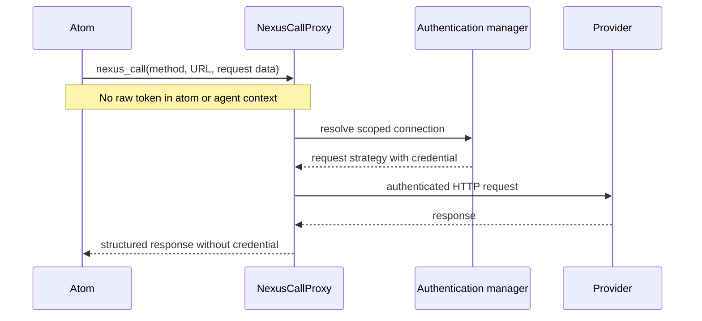
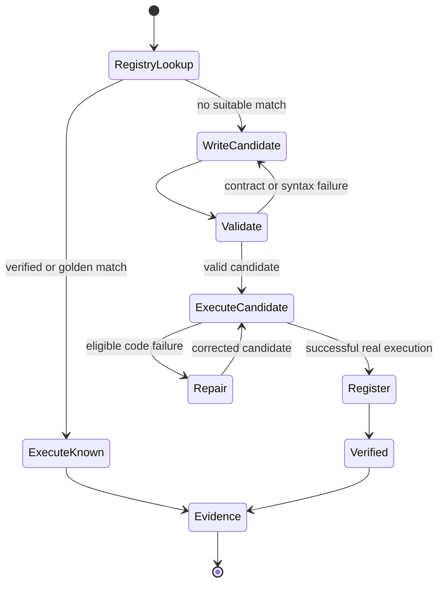

# System Bundles and Atoms

JarvisCore integrations are built from **atoms**: small, typed Python functions
that perform one provider action. The runtime loads shipped atoms into a
versioned `FunctionRegistry`, exposes qualifying atoms as tools, records their
execution evidence, and can register a proven replacement when an atom's source
is genuinely defective.

A **system bundle** is generated registry metadata and code-generation context
for the atoms associated with one provider. It is not a long-running tool server
and it does not hold credentials.

```mermaid
flowchart LR
    Task["Agent task"] --> Search["Registry-first lookup"]
    Search -->|"verified or golden match"| Tool["Typed atom tool"]
    Search -->|"no suitable match"| Generate["Generate candidate code"]
    Generate --> Validate["Validate and execute in sandbox"]
    Validate -->|"successful evidence"| Register["Register immutable version"]
    Register --> Tool
    Tool --> Proxy["Nexus call boundary"]
    Proxy --> Provider["External provider API"]
    Provider --> Evidence["Result and execution evidence"]
    Evidence --> Registry["Update reliability stage"]
```



## The atom contract

An atom is one provider call with a signature that becomes its tool schema. A
current atom has:

- a `{system}_{verb}_{object}` function name;
- an `async def` entry point;
- typed parameters and a `dict` result;
- a docstring describing the action and linking to provider documentation;
- provider access through `nexus_call()` rather than a token parameter;
- a module-level `ATOM_POLICY` describing effects and idempotency.

```python title="jarviscore/integrations/atoms/slack/slack_send_message.py"
ATOM_POLICY = {
    "effect": "notify",
    "approval": "never",
    "idempotency_fields": ["channel", "text"],
    "consequence": "Posts one message to the selected Slack channel.",
}


async def slack_send_message(
    channel: str,
    text: str,
    thread_ts: str | None = None,
) -> dict:
    """Send a message through the Slack API."""
    payload = {"channel": channel, "text": text}
    if thread_ts:
        payload["thread_ts"] = thread_ts

    response = await nexus_call(
        "POST",
        "https://slack.com/api/chat.postMessage",
        headers={"Content-Type": "application/json"},
        json=payload,
    )
    if not response["ok"]:
        return {"success": False, "error": response["body"]}
    return {"success": True, "data": response["json"]}
```

The exact response shape can preserve provider-native information. The durable
contract is that the function returns structured data and reports provider
failure honestly; an HTTP status alone is not a business decision.

## Effect policy

`ATOM_POLICY` lets the runtime reason about side effects before execution.

| Field | Allowed values | Meaning |
|---|---|---|
| `effect` | `read`, `write`, `notify`, `destructive` | The external effect class |
| `approval` | `never`, `required` | Whether the action needs explicit human approval |
| `idempotency_fields` | Function parameter names | Inputs that identify one intended mutation |
| `consequence` | Short description | The real-world change produced by the atom |

`write`, `notify`, and `destructive` atoms require idempotency fields and a
consequence. Destructive atoms require approval. An atom that performs HTTP
`DELETE` must declare a destructive policy.

The contract is checked from Python syntax by
`jarviscore.execution.atom_contract.read_contract()`. Invalid source is not
offered to agents as a callable capability.

## Credentials stay outside the atom

Atoms do not accept raw credential parameters and do not retrieve provider
tokens. `nexus_call()` sends the provider intent through `NexusCallProxy`, where
the runtime validates the host, resolves the connection, injects authentication,
and performs the HTTP call.



The proxy may refresh an expired OAuth connection and retry once. Authentication,
permission, rate-limit, and truthful provider refusals are not evidence that atom
source should be rewritten.

## Catalog ownership

Shipped atoms are loaded into a fresh registry at startup. Existing registries
receive missing shipped atoms without discarding local execution history or
valid local repairs. That seeding behavior belongs to the runtime model; the
provider and atom inventory does not.

Use the installed package for machine-readable inventory:

```bash
jarviscore atom list
jarviscore atom list --bundle hubspot
```

Use the [Integrations guide](../guides/integrations.md) for the human-readable
provider and atom catalog. Keeping that list in one place prevents concept pages
from drifting when integrations are added or renamed.

Shipped external atoms are hand-audited against provider documentation and seed
as `verified`. Newly generated functions enter as `candidate` and need successful
execution evidence before promotion.

## The FunctionRegistry

`FunctionRegistry` owns immutable source versions and current metadata. A
registration writes a new atom version instead of mutating the prior source.
Metadata includes:

- provider system, capabilities, description, and tags;
- current version, source path, and SHA-256 hash;
- execution count, success/failure counts, and average duration;
- current reliability stage and consecutive-success streak;
- repair lineage such as `repair_of_version`;
- whether the source is managed by the shipped catalog.

The local registry can publish an index to Redis for fleet discovery and copy
source/metadata to configured blob storage. Those persistence details are runtime
implementation; agents interact with the registry through tool discovery rather
than reading storage paths.

### Reliability stages

| Stage | Entry condition | Failure behavior |
|---|---|---|
| `candidate` | New generated function without execution proof | Remains candidate; streak resets |
| `verified` | Shipped audited atom or at least one consecutive successful execution | Demotes to candidate; streak resets |
| `golden` | At least five consecutive successful executions | Demotes to verified; streak resets |

Stages answer "does this work now?" rather than "did this ever work?" A failure
records its type, resets the success streak, and demotes one level. Credential
boundary failures are excluded because the atom did not execute.

## How AutoAgent finds and executes atoms

`CoderSubAgent` follows a registry-first path:

1. Normalize the task intent and call `check_registry`.
2. Rank matching atom metadata. Despite its historical method name,
   `semantic_search()` is lexical ranking; provider authority comes from the
   task/capability context, not substring matching.
3. Offer a qualifying verified or golden atom as a typed tool.
4. Execute the atom through the sandbox and Nexus boundary.
5. Record successful or failed execution evidence in the registry.

If no suitable atom exists, the Coder can write candidate code, validate it,
execute it, and register it only after successful execution. Registration without
a successful `candidate_id` is rejected.



## Repair is evidence-bound

A registered atom enters repair only after an eligible failure was observed in
the current run. The Coder must inspect the exact current source/version, submit
a replacement under the same function identity, and execute it successfully
against the original invocation.

Registration rejects stale repairs when the current atom version changed after
repair began. A successful replacement records `repair_of_version` and the
observed failure while retaining all prior immutable source versions.

## What a system bundle is

`FunctionRegistry.create_system_bundle(system_name)` generates a
`{System}Capabilities` class from that system's verified and golden functions.
The class describes available methods and capabilities and is cached as Python
source. `prepare_code_with_bundle()` can prepend it to generated code as
code-generation context.

The generated methods intentionally raise `NotImplementedError`; a bundle is not
a credential-bearing SDK client and application code should not instantiate it
to call a provider. During normal AutoAgent execution, the Coder offers validated
atoms as native tools, and custom generated provider code uses `nexus_call()`.

## Relationship to MCP { #this-is-not-mcp }

MCP and JarvisCore atoms solve adjacent problems at different boundaries.

| Concern | MCP server | JarvisCore atom |
|---|---|---|
| Unit | Tool exposed by a separate server | Typed Python provider function in the registry |
| Discovery | Client/server protocol discovery | Registry metadata and capability-aware runtime context |
| Execution | RPC to the MCP server | Sandbox/native tool execution through runtime boundaries |
| Credentials | Defined by each MCP deployment | Nexus resolves credentials outside agent-visible code |
| Evidence | Server-specific | Registry stage, execution stats, immutable versions, and repair lineage |

JarvisCore 1.11 does **not** ship a first-party MCP client. An application may
wrap an existing MCP client behind a `CustomAgent`, but that is application code,
not a built-in compatibility promise. Keep working MCP servers when they already
solve your tool boundary; use atoms when you want JarvisCore's registry,
execution evidence, Nexus boundary, and repair lifecycle.

## What to read next

- [Integrations](../guides/integrations.md): browse installed systems and atom
  names.
- [Testing Atoms](../guides/testing-atoms.md): validate custom atom source and
  connected behavior.
- [Nexus](nexus.md): understand the credential boundary.
- [AutoAgent](../guides/autoagent.md): see how the Kernel offers and executes
  tools.