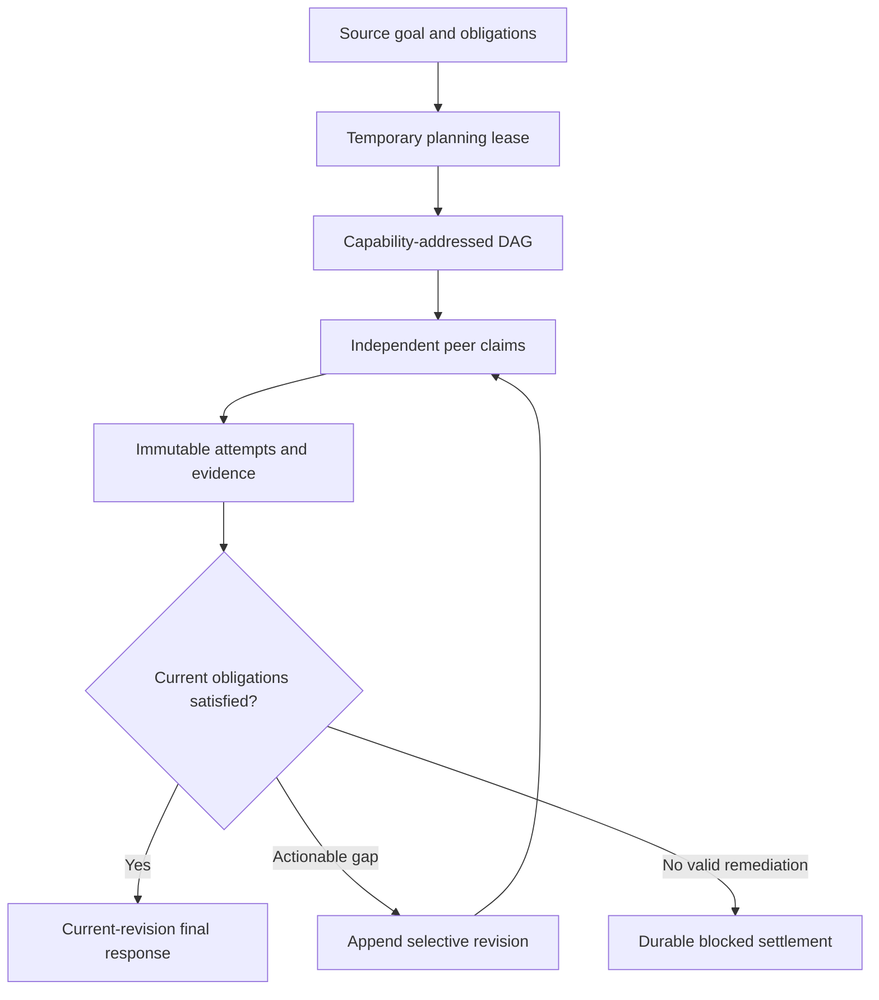
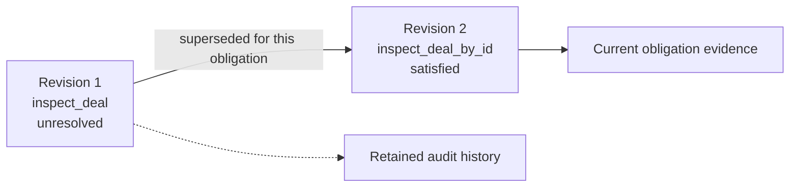

# Durable Goal Execution

`Mesh.execute_goal()` turns one natural-language objective into durable,
capability-addressed work. Redis holds the source goal, obligations, revisions,
claims and outputs; peers claim work independently. Planning does not create a
manager agent and the node that publishes a plan has no execution authority.

This API is different from the other two ways to run work:

| API | Use it when | Who defines the steps |
|---|---|---|
| `agent.execute_goal()` | One `AutoAgent` should run its own Plan, Execute, Evaluate loop | That AutoAgent |
| `mesh.workflow()` | Your application already knows the DAG | Your Python code |
| `mesh.execute_goal()` | The goal should be compiled into distributed, capability-addressed work | A temporary planning lease |



## Source-grounded obligations

The planner receives immutable source blocks derived from user-authored goal
lines and selects a `source_ref` for each semantic obligation. JarvisCore then
hydrates the durable `source_quote` itself from the selected block. The model
never has to reproduce exact source text, and unknown references fail closed.

For a one-line goal, `source-1` identifies the complete goal. Multi-line goals
also expose each non-empty line as its own block and `source-all` for requirements
that span lines. The model still decides what the obligations mean; the compiler
owns only their exact provenance binding. Existing persisted ledgers continue to
carry validated `source_quote` values.

## Define capability authority

Every participating agent declares capability names. For provider work, add a
capability contract so planning knows which effects and systems that capability
may use:

```python
from jarviscore import AutoAgent, Mesh


class RevenueOperations(AutoAgent):
    role = "revenue_operations"
    capabilities = ["pipeline_inspection"]
    capability_descriptions = {
        "pipeline_inspection": "Inspect and reconcile CRM pipeline state.",
    }
    capability_contracts = {
        "pipeline_inspection": {
            "effects": ["read", "propose"],
            "systems": ["hubspot"],
        },
    }


mesh = Mesh(config={
    "mesh_response_capability": "action_briefing",
    "execution_budget": {
        "max_seconds": 900,
        "max_tokens": 240_000,
        "max_epochs_per_step": 8,
    },
})
mesh.add(RevenueOperations)
```

Effects are `read`, `propose`, `write`, `notify`, `destructive` or
`final_response`. A `write`, `notify` or `destructive` step names exactly one
authorized system. The claiming peer still decides which atom or provider call
to use.

At least one started node needs an agent with an LLM for initial planning and
reconciliation decisions. A pure `CustomAgent` node can execute published work,
but it does not gain an LLM planner automatically.

## Execute and inspect a goal

```python
await mesh.start()

result = await mesh.execute_goal(
    "Inspect the active opportunity and prepare a decision brief.",
    workflow_id="opportunity-2026-09-11",
    context={"tenant_id": "acme"},
)

print(result["status"])
print(result["obligation_status"])
print(result["response_status"])
```

Caller context is copied without private keys or execution authority. The
framework derives capability, effect and systems from the published step and
injects them into the claiming agent's task context.

Source-backed products should set `workspace_required=True`. Source resolution
and snapshot integrity validation then complete before the goal is registered or
the planner sees it. Explicit structured context is accepted from APIs and CLIs;
message-only clients rely on the Mesh's provider-constrained source preflight.
Missing source identity, unavailable adapters and invalid snapshots fail the
request instead of producing a source-less DAG.

## Give the planner the Mesh's method

The source goal says what the user wants. The capability catalog says what the
available peers can do. A product can also declare `mesh_planning_brief` to tell
the generic planner what kind of team it is compiling work for:

```python
mesh = Mesh(config={
    "mesh_planning_brief": """This Mesh reviews shipped services. For broad
    review work, establish an executed baseline, investigate falsifiable risks,
    verify findings independently, and report tested coverage and residual risk.
    A negative result requires substantial executed coverage. Explicit user
    scope and do-not-modify constraints override the normal method.""",
})
```

The brief informs DAG drafting, independent audit, repair, amendment and
reconciliation. It is deliberately excluded from obligation extraction: product
method cannot manufacture a user request. Source constraints and approval
boundaries always outrank the normal method, and the capability catalog remains
the authority boundary.

A useful brief answers five questions:

1. On what occasion is this Mesh used?
2. What method does it normally apply to broad work?
3. How should it adapt when an intermediate hypothesis or path fails?
4. What evidence makes the work complete, including a valid negative result?
5. Which explicit user constraints narrow or override the normal method?

Describe outcomes and evidence standards, not a fixed list of agent instances,
tools or provider calls. The planner still constructs the task-specific DAG and
peers still claim capabilities directly.

## Task context received by agents

Both `AutoAgent.execute_task()` and `CustomAgent.execute_task()` receive the
same distributed context:

| Key | Meaning |
|---|---|
| `objective` | Exact immutable source goal |
| `workflow_plan` | Goal, obligation ledger and all revisioned step definitions |
| `previous_step_results` | Durable artifacts from direct `depends_on` producers; all workflow artifacts for a final response |
| `previous_step_interpretations` | Semantic assessments from dependencies |
| `workflow_id`, `step_id` | Durable execution identity |
| `capability`, `effect`, `systems` | Authority declared by the published step |
| `execution_budget` | Shared workflow budget |
| `workflow_evidence` | Final-response snapshot of artifact IDs, interpretations, states and obligations; full artifacts remain in `previous_step_results` |

For normal steps, transitive ancestry establishes execution order but does not
implicitly forward artifacts. A step that needs outputs from multiple earlier
producers must list each producer directly in `depends_on`. This keeps evidence
flow explicit and prevents unrelated ancestral payloads from inflating context.
A dependency contributes only the artifact promised by its own task and success
criterion; a summary, ranking or approval does not implicitly relay the evidence
it consumed. Steps needing both original evidence and a transformed decision
must depend directly on both producers.

The independent planning audit may express a missing artifact edge as a typed
`add_dependencies` correction. The auditor still decides which evidence the
target step needs; JarvisCore validates and applies those exact edges, rejects
unknown or cyclic references, and audits the corrected DAG again. Explanatory
audit prose is never parsed into graph behavior.

Capabilities may additionally declare `artifact_types` and
`requires_artifact_types`. JarvisCore deterministically closes direct edges from
consumers to every matching producer, including immutable producers during a
reconciliation revision. Products that assemble nested evidence can declare
`artifact_reference_paths`; agents then select `artifact_ref` locations while
JarvisCore copies the exact validated values before product validation.

When interpreted domain work leaves source obligations unresolved, response
authority remains pending while reconciliation amends or settles that revision.
An amended response step supersedes pending response steps from prior revisions,
so users receive one answer from current obligation state.

An exhausted execution epoch may continue from its durable checkpoint, up to
`max_epochs_per_step`. For source-backed work, JarvisCore also exports the
partial same-step `WorkspaceDelta` and reapplies it before the next epoch. Tool
history, mutation receipts, and file state therefore advance together. A request
larger than an entire epoch is terminal because starting another identical epoch
cannot make it fit.

Kernel coroutine tools execute on the asyncio event loop. Synchronous tools run
in a worker thread with the current workflow context propagated, so a blocking
provider or sandbox call cannot starve distributed claim renewal. Redis fencing
still rejects results from a claimant that genuinely loses ownership.

## Completion is evidence-derived

`DONE` is an agent proposal to evaluate the current durable state. It is not a
state transition by itself. Normal turns and budget-exhaustion landing turns use
the same completion evaluator. Rejected completion preserves tool history,
thoughts, failures and work-product state; actionable lease exhaustion continues
in a fresh bounded epoch rather than becoming a human wait. When repeated
completion proposals leave the same actionable gate unsatisfied, that boundary
also checkpoints the same state; the next epoch receives the gate evidence as
its critical error instead of restarting an equivalent dispatch.

Products may declare `execution_contract.required_tool_groups`. Each group lists
equivalent tools, and durable history must contain at least one invocation from
every group before completion is eligible. The gate reports observed tools and
missing groups; it does not decide domain truth or choose the next action.
Changing result wording without changing the observed evidence or performing a
new tool action is not progress and cannot reset the no-progress boundary.

Every tool invocation receives an immutable, workflow-scoped `tool_receipt_id` in
Kernel state. Command observations in final JSON must carry that receipt ID.
JarvisCore replaces model-authored command,
exit-code, output, timestamp and duration fields with the authoritative runtime
receipt before accepting DONE. Direct dependencies carry already-grounded receipts
to downstream synthesis. Missing and unknown receipts fail closed and keep the
same agent state active. Products can use the public `CommandObservation` model
without implementing evidence matching or retry logic.

`workspace_write` and hash-guarded `workspace_edit` use the same contract through
the public `WorkspaceMutation` model. JarvisCore binds path, hash, byte size and
executable state to the tool receipt, then reconciles cited local mutations
against the final exported `WorkspaceDelta`. A mutation that was reverted,
overwritten, or produced no net change cannot support an applied claim. Receipts
created before a bounded epoch continuation remain valid only while their exact
file content remains in the cumulative same-step workspace. Product
normalization and JSON repair run before this final Mesh-owned integrity check,
so they cannot invent receipt evidence.

Workspace deltas are cumulative from the immutable source snapshot. When a step
directly depends on both an ancestor and its descendant, the descendant delta is
the maximal branch and already contains the ancestor's accepted changes. Mesh
materialization applies only maximal branches, while incompatible parallel sibling
branches still fail with `WorkspaceDeltaConflict`.

Existing agents do not need to change. A successful result without an
`interpretation` is reduced from execution status: a completed attempt satisfies
the obligations covered by that step.

## Optional semantic interpretations

Return an interpretation when domain evidence can distinguish "the attempt
completed" from "the source requirement is satisfied". This is how an agent
can hold or reject its assigned path without teaching JarvisCore domain rules.

```python
async def execute_task(self, task):
    artifact = await self.inspect_pipeline(task)
    plan = task["context"]["workflow_plan"]
    step = next(item for item in plan["steps"] if item["id"] == task["id"])
    covered = list(step["covers"])

    if artifact["stage"] is None:
        interpretation = {
            "meaning": "The deal exists, but its current stage is not verified.",
            "satisfied_requirements": [],
            "unmet_requirements": covered,
            "evidence_refs": [artifact["record_id"]],
            "verdict": "unsatisfied",
            "decision": "hold",
        }
    else:
        interpretation = {
            "meaning": "The current deal stage was read from the CRM.",
            "satisfied_requirements": covered,
            "unmet_requirements": [],
            "evidence_refs": [artifact["record_id"]],
            "verdict": "satisfied",
            "decision": "proceed",
        }

    return {
        "status": "success",
        "output": artifact,
        "interpretation": interpretation,
    }
```

`satisfied_requirements` and `unmet_requirements` contain the stable obligation
IDs from the current step's `covers` list, not paraphrased descriptions. Assess
each covered ID exactly once. Recommended verdicts are `satisfied`, `partial`
and `unsatisfied`; recommended decisions are `proceed`, `hold` and `reject`.

A framework-owned final-response step has `covers=[]`. It presents current
workflow truth and cannot satisfy source obligations. When multiple steps in one
dependency path mention the same obligation, only terminal domain work retains
coverage; ancestor steps remain evidence for that terminal judgment.

Step dependencies use `dependency_policy="satisfied"` by default. Redis decides
whether dependencies are execution-ready; the recipient peer decides whether a
completed dependency's semantic uncertainty materially prevents its task. A
planner may set `dependency_policy="terminal_evidence"` only for work explicitly
intended to diagnose or remediate a failed or blocked attempt. Final-response
steps always receive terminal evidence so they can explain blocked and incomplete
goals.

## Current obligation truth

Attempts are immutable execution history. The obligation projection records
which attempts currently represent each source requirement:



The revision 1 output remains available for audit. Revision 2 supersedes it only
for the obligation IDs covered by the new step. Satisfied obligations not named
by the delta retain their current source attempt and are not rerun.

Automatic reconciliation starts only after the current revision is terminal,
an unresolved obligation has semantic evidence, an LLM planner is available and
the revision budget permits another attempt. The planner may append remediation
or settle the remaining goal as blocked. It cannot rewrite the source obligation
ledger or mutate earlier attempts.

`Mesh.replan_goal()` uses the same append-only mechanism for explicit
continuation. Call it only while obligations remain unresolved:

```python
result = await mesh.replan_goal(
    "opportunity-2026-09-11",
    reason="A direct CRM record-read capability is now available.",
)
```

## Read terminal status correctly

The result reports three independent facts:

| Field | Values | Question answered |
|---|---|---|
| `status` | `completed`, `failed`, `waiting`, `cancelled` | Did the current revision execute? |
| `obligation_status` | `satisfied`, `blocked`, `incomplete` | Is the source goal fulfilled? |
| `response_status` | `completed`, `failed`, `waiting`, `not_required` | Was the current user-facing response produced? |

Do not infer goal truth from `status` alone. For example, provider actions may
be complete while response synthesis fails:

```python
{
    "status": "failed",
    "obligation_status": "satisfied",
    "response_status": "failed",
}
```

Agent Desk renders `completed` as **Execution finished**. The result separately
renders **Goal satisfied**, **Goal blocked** or **Goal incomplete** from
`obligation_status`.

`revision` identifies the current plan. `steps` retains attempts from every
revision; filter with `step["plan_revision"] == result["revision"]` when you
need only current execution. `result_summary` is selected from the current
revision's final response.

## Waiting, cancellation and shutdown

Resume a waiting step with the same workflow and step identity:

```python
result = await mesh.resume_goal(
    workflow_id,
    step_id,
    context={"human_response": "approved"},
)
```

Cancellation is durable. It fences future claims and prevents an expired
executor from committing after cancellation:

```python
mesh.cancel_goal(workflow_id, reason="Request withdrawn")
```

Cancelling the coroutine running `execute_goal()` also cancels the durable
workflow before re-raising `CancelledError`.

## Deployment rules

- Redis is required for `Mesh.execute_goal()`, resume, replan and cancellation.
- Use stable `workflow_id` values for retry and observation.
- Run compatible framework versions on every node that can claim the same DAG.
- Bound reconciliation with `mesh_max_reconciliation_revisions` and the shared
  `execution_budget`.
- Configure `mesh_response_capability` only when a peer owns
  `final_response` authority.