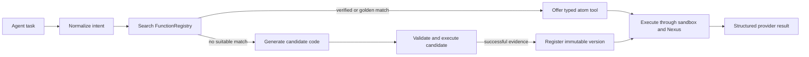

# Integrations and atom catalog

JarvisCore integrations are small, typed Python functions called **atoms**. The
runtime seeds shipped atoms into `FunctionRegistry`, searches the registry before
generating code, and offers qualifying atoms to `AutoAgent` as native tools.
Applications do not need to enumerate atom names in prompts.

For the architecture behind policies, stages, versions, and repair, read
[System Bundles and Atoms](../concepts/system-bundles.md). This guide owns the
provider catalog and the practical setup path.

## Use an integration from an agent

Declare what the agent is authorized to do. The Kernel selects a matching atom
from the registry when one exists.

```python
from jarviscore import AutoAgent


class OperationsAgent(AutoAgent):
    role = "operations"
    capabilities = ["team_messaging", "issue_management", "documentation"]
    system_prompt = """
    You coordinate operational work across connected systems. Verify provider
    state before mutating it and return the resulting record identifiers.
    """
```

`capabilities` controls peer discovery and distributed work authority. It does
not load a private subset of the atom catalog; registry search still decides
which qualifying tool matches the current task.

## How selection works



The registry ranks metadata and execution evidence. A matched function is not a
business decision: the agent still reasons from the task, provider evidence, and
its capability contract.

## Configure credentials with Nexus

Provider atoms call `nexus_call()`. They do not accept tokens, read provider
secrets from environment variables, or expose credentials to model context.
Register the connection required by your deployment:

```bash
jarviscore nexus init
jarviscore nexus register github \
  --client-id=YOUR_ID \
  --client-secret=YOUR_SECRET
jarviscore nexus test github
```

API-key and basic-auth providers use the same registration command with their
provider-specific flags. Run `jarviscore nexus register --help` and
`jarviscore nexus register <provider> --help` for the installed CLI contract.
See [Nexus Credentials](nexus.md) for local and gateway deployment.

## Installed catalog

<!-- GENERATED_ATOM_CATALOG -->

## Inspect exact atom names

The generated directory above deliberately summarizes bundles. The installed
package is authoritative for individual atom names:

```bash
# Every installed bundle and atom
jarviscore atom list

# One bundle
jarviscore atom list --bundle google_chat
```

This matters when applications pin different JarvisCore versions: the docs show
the source tree used to build them, while the CLI shows the package actually
running in that environment.

## Build a custom atom

A custom atom follows the same contract as a shipped atom:

```python title="jarviscore/integrations/atoms/linear/linear_close_issue.py"
ATOM_POLICY = {
    "effect": "write",
    "approval": "never",
    "idempotency_fields": ["issue_id"],
    "consequence": "Moves one Linear issue to a closed state.",
}


async def linear_close_issue(issue_id: str, state_id: str) -> dict:
    """Close a Linear issue. https://developers.linear.app/docs/graphql/working-with-the-graphql-api"""
    response = await nexus_call(
        "POST",
        "https://api.linear.app/graphql",
        json={
            "query": "mutation Close($id: String!, $state: String!) { issueUpdate(id: $id, input: {stateId: $state}) { success } }",
            "variables": {"id": issue_id, "state": state_id},
        },
    )
    if not response["ok"]:
        return {"success": False, "error": response["body"]}
    return {"success": True, "issue_id": issue_id, "data": response["json"]}
```

The required contract is:

1. Filename and top-level function name match.
2. The function name starts with the provider and follows
   `{system}_{verb}_{object}`.
3. The entry point is `async def`, has typed parameters, and returns a `dict`.
4. The docstring describes the action and links to provider documentation.
5. Provider access goes through `nexus_call()` with no token parameter.
6. `ATOM_POLICY` declares effect, approval, consequence, and mutation identity.
7. Provider failures are returned as structured results rather than hidden.

Validate the source before any live call:

```bash
jarviscore atom test \
  --bundle linear \
  --atom linear_close_issue \
  --mode dry-run
```

Then verify credential resolution through Nexus:

```bash
jarviscore atom test \
  --bundle linear \
  --atom linear_close_issue \
  --connection-id CONNECTION_ID \
  --mode integration
```

The integration command validates that the connection resolves; application
integration tests should still exercise the provider behavior you depend on.
See [Testing Custom Atoms](testing-atoms.md) for the complete workflow.

## Add a provider to the shipped catalog

A framework contribution requires three source changes:

1. Add atom modules under `jarviscore/integrations/atoms/<provider>/`.
2. Add provider metadata to `PROVIDER_META` in
   `jarviscore/integrations/seed_registry.py`.
3. Add contract and provider-response tests.

Do **not** edit a catalog table. This page regenerates from those authoritative
sources during the documentation build.
