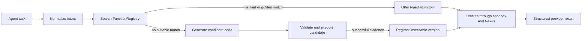

# Integrations and atom catalog

JarvisCore integrations are small, typed Python functions called **atoms**. The
runtime seeds shipped atoms into `FunctionRegistry`, searches the registry before
generating code, and offers qualifying atoms to `AutoAgent` as native tools.
Applications do not need to enumerate atom names in prompts.

For the architecture behind policies, stages, versions, and repair, read
[System Bundles and Atoms](../concepts/system-bundles.md). This guide owns the
provider catalog and the practical setup path.

## Use an integration from an agent

Declare what the agent is authorized to do. The Kernel selects a matching atom
from the registry when one exists.

```python
from jarviscore import AutoAgent


class OperationsAgent(AutoAgent):
    role = "operations"
    capabilities = ["team_messaging", "issue_management", "documentation"]
    system_prompt = """
    You coordinate operational work across connected systems. Verify provider
    state before mutating it and return the resulting record identifiers.
    """
```

`capabilities` controls peer discovery and distributed work authority. It does
not load a private subset of the atom catalog; registry search still decides
which qualifying tool matches the current task.

## How selection works


```mermaid
flowchart LR
    Task["Agent task"] --> Intent["Normalize intent"]
    Intent --> Search["Search FunctionRegistry"]
    Search -->|"verified or golden match"| Tool["Offer typed atom tool"]
    Search -->|"no suitable match"| Generate["Generate candidate code"]
    Tool --> Execute["Execute through sandbox and Nexus"]
    Generate --> Validate["Validate and execute candidate"]
    Validate -->|"successful evidence"| Register["Register immutable version"]
    Register --> Execute
    Execute --> Result["Structured provider result"]
```

The registry ranks metadata and execution evidence. A matched function is not a
business decision: the agent still reasons from the task, provider evidence, and
its capability contract.

## Configure credentials with Nexus

Provider atoms call `nexus_call()`. They do not accept tokens, read provider
secrets from environment variables, or expose credentials to model context.
Register the connection required by your deployment:

```bash
jarviscore nexus init
jarviscore nexus register github \
  --client-id=YOUR_ID \
  --client-secret=YOUR_SECRET
jarviscore nexus test github
```

API-key and basic-auth providers use the same registration command with their
provider-specific flags. Run `jarviscore nexus register --help` and
`jarviscore nexus register <provider> --help` for the installed CLI contract.
See [Nexus Credentials](nexus.md) for local and gateway deployment.

### Zendesk Support tickets

Use `zendesk_support` for the Ticketing API. The separate `zendesk_chat`
bundle targets legacy Live Chat and does not provide Support ticket operations.

Create an OAuth client in Zendesk Admin Center and add the Nexus callback URL
as its redirect URL. The Nexus authorization flow uses PKCE. Set the client's
allowed scopes to the capabilities the integration needs, then register the
tenant and client with Nexus:

```bash
jarviscore nexus register zendesk_support \
  --subdomain=YOUR_SUBDOMAIN \
  --client-id=YOUR_CLIENT_ID \
  --client-secret=YOUR_CLIENT_SECRET
jarviscore nexus test zendesk_support
```

The profile requests `tickets:read`, `tickets:write`, `users:read`, and
`organizations:read`. On the tested Zendesk tenant, the Search API also
returned `403` unless the OAuth token included Zendesk's generic `read` scope.
Zendesk defines that scope as GET access across all resources, so the default
profile does not request it. Individual ticket, comment, requester, and
organization reads work with the resource-specific scopes above. The subdomain
is one DNS label, without a scheme or the
`.zendesk.com` suffix. Nexus uses it to construct the tenant-specific OAuth
authorization and token endpoints and the `/api/v2` base URL. Store the OAuth
secret in Nexus. The CLI keeps only the non-secret tenant locator in the local
encrypted store because Nexus token strategies do not include API profile
metadata; atoms accept no token or caller-selected host.

`AutoAgent` discovers the ticket, comment, requester, organization, and search
atoms through the function registry. The Zendesk call proxy binds relative API
paths to the tenant metadata saved during registration, requires HTTPS, and
does not follow redirects. Zendesk Search returns at most 1,000 results per
query; the search atom sets `complete` to `false` and explains the cap when a
query exceeds it. Ticket comments are fetched through cursor pagination.

Public replies and internal notes are separate atoms. Both declare required
human approval, and the public reply is classified as a notification. Zendesk
creates both comment types through the [ticket update endpoint](https://developer.zendesk.com/api-reference/ticketing/tickets/tickets/):
public replies set `comment.public` to `true`; internal notes set it to
`false`. See the [ticket comments reference](https://developer.zendesk.com/api-reference/ticketing/tickets/ticket_comments/)
and [Zendesk OAuth scopes](https://developer.zendesk.com/api-reference/ticketing/oauth/grant_type_tokens/)
for provider behavior and token scopes.

## Installed catalog

<!-- GENERATED_ATOM_CATALOG -->

## Inspect exact atom names

The generated directory above deliberately summarizes bundles. The installed
package is authoritative for individual atom names. See the
[`jarviscore atom list`](../reference/cli.md#atom-list) command reference for
options and output:

```bash
# Every installed bundle and atom
jarviscore atom list

# One bundle
jarviscore atom list --bundle google_chat
```

This matters when applications pin different JarvisCore versions: the docs show
the source tree used to build them, while the CLI shows the package actually
running in that environment.

## Build a custom atom

A custom atom follows the same contract as a shipped atom:

```python title="jarviscore/integrations/atoms/linear/linear_close_issue.py"
ATOM_POLICY = {
    "effect": "write",
    "approval": "never",
    "idempotency_fields": ["issue_id"],
    "consequence": "Moves one Linear issue to a closed state.",
}


async def linear_close_issue(issue_id: str, state_id: str) -> dict:
    """Close a Linear issue. https://developers.linear.app/docs/graphql/working-with-the-graphql-api"""
    response = await nexus_call(
        "POST",
        "https://api.linear.app/graphql",
        json={
            "query": "mutation Close($id: String!, $state: String!) { issueUpdate(id: $id, input: {stateId: $state}) { success } }",
            "variables": {"id": issue_id, "state": state_id},
        },
    )
    if not response["ok"]:
        return {"success": False, "error": response["body"]}
    return {"success": True, "issue_id": issue_id, "data": response["json"]}
```

The required contract is:

1. Filename and top-level function name match.
2. The function name starts with the provider and follows
   `{system}_{verb}_{object}`.
3. The entry point is `async def`, has typed parameters, and returns a `dict`.
4. The docstring describes the action and links to provider documentation.
5. Provider access goes through `nexus_call()` with no token parameter.
6. `ATOM_POLICY` declares effect, approval, consequence, and mutation identity.
7. Provider failures are returned as structured results rather than hidden.

Validate the source before any live call:

```bash
jarviscore atom test \
  --bundle linear \
  --atom linear_close_issue \
  --mode dry-run
```

Then verify credential resolution through Nexus:

```bash
jarviscore atom test \
  --bundle linear \
  --atom linear_close_issue \
  --connection-id CONNECTION_ID \
  --mode integration
```

The integration command validates that the connection resolves; application
integration tests should still exercise the provider behavior you depend on.
See [Testing Custom Atoms](testing-atoms.md) for the complete workflow.

## Add a provider to the shipped catalog

A framework contribution requires three source changes:

1. Add atom modules under `jarviscore/integrations/atoms/<provider>/`.
2. Add provider metadata to `PROVIDER_META` in
   `jarviscore/integrations/seed_registry.py`.
3. Add contract and provider-response tests.

Do **not** edit a catalog table. This page regenerates from those authoritative
sources during the documentation build.
