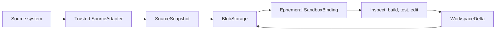

# Source workspaces

Many agent tasks operate on a related collection of files rather than one API
record. Source workspaces let a Mesh inspect, execute, and propose changes over
that collection without adding another persistence tier. The source may be a
code repository, local project tree, exported archive, document collection,
object-storage prefix, model bundle, dataset or build artifact.

BlobStorage remains the durable byte store. A `SourceSnapshot` is an immutable
manifest of paths and content-addressed blobs. A `SandboxBinding` projects that
manifest into a temporary `CoderSandbox` filesystem for one claimed step. A
`WorkspaceDelta` stores only the step's accepted changes back in BlobStorage.



## Universal workspace contract

Adapters own source-specific acquisition. JarvisCore owns everything after that
boundary: immutable persistence, integrity verification, isolated per-step
materialization, direct workspace tools, copy-on-write deltas, conflict
detection and cleanup. Adding a new source type does not create a new execution
model.

When `workspace_required` is true, the Mesh resolves source identity before
planning. A caller may supply `workspace_source` explicitly through an API or
CLI. Otherwise, the Mesh uses its planning model to extract only the source
identity explicitly named in the goal, constrained to
`workspace_source_catalog` and registered adapters. Adapter validation remains
authoritative. Missing or ambiguous identity fails before goal registration,
which prevents a source-backed Mesh from silently degrading into prompt-only
analysis.

This resolution is internal to Mesh execution. General chat or task interfaces
do not need provider-specific controls. A product declares trusted source types
and users continue to state the source in the task naturally.

Snapshot limits, allowed commands, command timeouts and build-cache environment
in caller context are ignored. Configure them on `Mesh`; they are execution
authority, not user intent. Cache paths are node-local and should be writable by
the Mesh worker. Only recognized package-manager cache variables are admitted;
the parent process environment and secrets are not inherited.

## GitHub reference adapter

GitHub is the first built-in adapter and demonstrates the universal contract for
a remote authenticated source. Its OAuth app and account must be connected
through Nexus.

```python
from jarviscore import Mesh

mesh = Mesh(config={
    "nexus_enabled": True,
    "workspace_required": True,
    "workspace_snapshot_limits": {
        "max_files": 2_000,
        "max_total_bytes": 50 * 1024 * 1024,
        "max_file_bytes": 5 * 1024 * 1024,
        "concurrency": 8,
    },
    "workspace_allowed_commands": ["cargo"],
    "workspace_command_timeout_seconds": 600,
    "workspace_command_environment": {
        "CARGO_HOME": "/var/cache/jarviscore/cargo-home",
        "CARGO_TARGET_DIR": "/var/cache/jarviscore/cargo-target",
        "RUSTUP_HOME": "/opt/rustup",
    },
})

# Add capability-addressed peers, then start the Mesh.
await mesh.start()
result = await mesh.execute_goal(
    "Inspect, test, and propose a verified repair.",
    context={
        "workspace_source": {
            "provider": "github",
            "locator": "owner/repository",
            "revision": "main",
        }
    },
)
```

The adapter resolves `revision` to an immutable commit before planning. The
workflow context receives only compact source metadata and a BlobStorage
manifest reference, never repository contents or credentials.

## Step isolation and deltas

Each claimed step gets a fresh materialization of the immutable snapshot.
Dependency deltas are applied before execution. Successful local changes are
exported under:

```text
workflows/<workflow-id>/workspace_deltas/<step-id>/
```

Parallel branches may change different files. If two dependency branches change
the same path to different content, JarvisCore rejects the merge instead of
choosing one silently. Runtime and build directories such as `.tmp`, `output`,
`target`, `node_modules`, and `.venv` are excluded from deltas by default.

Final-response steps consume prior artifacts and do not materialize the source
again. Bindings clean up after success, failure, or cancellation.

## Coder workspace tools

Coder receives five direct tools when a workspace is attached:

| Tool | Purpose |
|---|---|
| `workspace_list` | List bounded file or directory metadata. |
| `workspace_read` | Read a bounded UTF-8 line range. |
| `workspace_search` | Search text and return path/line evidence. |
| `workspace_write` | Write one bounded UTF-8 file in the copy-on-write workspace. |
| `workspace_run` | Run a trusted allow-listed command in a workspace directory. |

These tools avoid generating Python merely to inspect or author files. Agents
should use `workspace_write` for fixtures instead of shell redirection, heredocs
or generated writer scripts. Path resolution rejects traversal outside the
workspace. Command permissions, timeout and cache environment extend the
existing CoderSandbox policy only through trusted Mesh configuration. A command
timeout is returned as typed evidence and does not terminate the workflow.

## Storage and distributed execution

Content-addressed file blobs are reused across repeated snapshots of the same
source and immutable revision. Hash and size checks run during hydration.

Local BlobStorage is node-scoped. A workflow using it is pinned to the node that
materialized the snapshot. Configure a shared BlobStorage backend for cross-node
claims.

## Large sources

Every adapter must reject sources beyond trusted limits. This is deliberate: an
unbounded collection must not consume arbitrary memory, API quota, disk or model
context. Large-source adapters may use sparse selection, pagination, streaming
or provider-native manifests while returning the same `SourceSnapshot` contract.

The built-in GitHub adapter uses recursive tree and Git blob APIs and rejects a
truncated tree. A future object-store adapter may paginate keys; an archive
adapter may stream entries; a dataset adapter may capture a selected manifest.
The execution and delta layers do not depend on those acquisition choices.

## Build a source adapter

An adapter implements one provider-neutral protocol:

```python
from jarviscore import SourceAdapter, SourceRef, SourceSnapshot


class ArchiveSource(SourceAdapter):
    async def capture(self, source: SourceRef) -> SourceSnapshot:
        ...
```

The adapter receives source identity and returns an immutable snapshot created
through the `BlobSnapshotStore` supplied by the application. It owns:

- validating provider-specific locator and revision syntax;
- resolving mutable revisions to immutable identities;
- reading source bytes through the appropriate credential boundary;
- enforcing provider-specific completeness, such as truncated-tree detection;
- applying trusted snapshot limits before unbounded hydration.

The adapter does not own sandbox creation, command execution, dependency deltas,
merge conflict decisions or cleanup. Those remain shared JarvisCore behavior.

Before planning, JarvisCore validates every adapter result against the requested
provider, locator and revision, reloads its persisted manifest from the Mesh's
BlobStorage, and verifies every blob size and hash. An adapter cannot return an
in-memory or foreign-store snapshot and still enter the DAG.

Use these public failures:

| Error | Meaning |
|---|---|
| `SourceContractError` | The request or adapter result violated source identity or response shape. |
| `SourceIntegrityError` | The persisted manifest or source bytes failed integrity validation. |
| `SnapshotLimitExceeded` | Trusted materialization limits rejected the source. |
| `GitHubSourceRequestError` | A GitHub request failed; status and bounded provider detail remain evidence, not routing decisions. |

New adapters should reproduce the cases in `tests/test_source_adapter_contract.py`:
valid persisted capture, identity preservation, rejection of foreign manifests,
and rejection of corrupted blobs. Provider tests should additionally cover
mutable-ref resolution, cache reuse, limits, malformed responses and executable
file modes.

For natural-language entry points, describe custom providers in trusted Mesh
configuration:

```python
mesh = Mesh(config={
    "workspace_required": True,
    "workspace_source_adapters": {"archive": archive_adapter},
    "workspace_source_catalog": {
        "archive": {
            "description": "A named source archive resolved by the application",
        },
    },
})
```

`workspace_source_resolver` may override model-based identity extraction with a
trusted callable. Its result is still constrained to the catalog and passes the
same adapter and snapshot validation.

## Authority boundaries

- Source capture is read-only acquisition through the adapter's trusted access
    boundary. The built-in GitHub adapter uses Nexus; local or embedded sources
    may require no credential service.
- Workspace mutation is local copy-on-write work and remains a proposal.
- Publishing changes back to any source system requires a separate capability
    and policy decision; a workspace adapter grants no publication authority.
- Source credentials never enter the snapshot, BlobStorage, prompt, or sandbox.